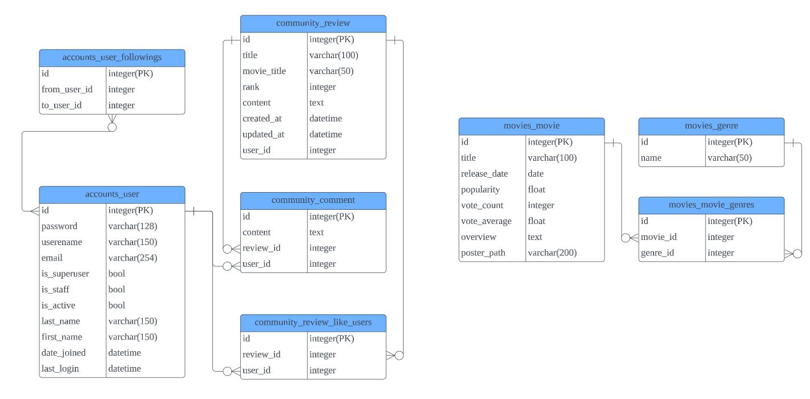

# Movie-Community_v8 [비동기 통신을 이용한 웹 사이트 구현]
## 📘 학습내용 📘
- AJAX 통신과 JSON 구조에 대한 이해
- 영화 추천 알고리즘 설계
- 비동기 통신을 활용한 스크립트 기능
- Bootstrap을 활용한 웹 사이트 디자인
## ⭐ 차별점 ⭐
1. 공통 (Base.html)
- 우측 하단에 TOP 버튼을 Fixed 포지션으로 고정하고, 클릭하면 비동기 통신으로 스크롤 최상단으로 이동하는 기능
2. 영화 소개 메인 페이지(영화 둘러보기)
- 상단에 Carousel을 활용하여 Popularity를 기준으로 TOP 5 선정, Auto Play 기능
- TOP 5에 마우스 커서를 올리면 투명도 설정된 캡션이 보이고, 클릭하면 해당 상세 페이지로 이동하는 기능
- 영화의 목록을 카드 형식으로 보여주고, 최신 순으로 배치
- 글자수를 통일하여 카드의 크기가 변경되지 않고 틀이 무너지지 않도록 설정
3. 영화 추천 페이지(취향저격)
- Radio Button의 change 이벤트를 활용해 선택한 장르의 영화만을 표시하는 기능
- Flex로 영화 목록을 가로 배치하고, CSS를 통해 스크롤바가 안보이도록 설정
- Wheel 이벤트를 활용해 마우스 스크롤이 상하가 아닌 좌우로 작동하는 기능
4. 영화 상세페이지
- Filter와 lt, gt 메서드를 활용해 이전 영화와 다음 영화 상세 페이지로 이동하는 기능

## 🙄 어려웠던 부분 🙄
- 댓글과 대댓글 작성 및 삭제 부분을 비동기 통신으로 처리하는데에 실패 : POST 요청을 위해 토큰을 가져다 써야 하는데, formTag가 여러 개 있어서 어떤 토큰을 가져올지 특정할 수 없는 문제 -> 설계 단계에서 이러한 부분도 생각해 최대한 간결하게 코드를 짜도록 해야겠다.
- 영화 추천 페이지 장르 복수 선택 기능 구현 실패 : 장르별 영화를 가져오는 방법으로 url을 추가 설정하여 GET요청 보내는 방식을 선택하여 한 번에 하나 씩의 영화만 불러오게 됨 -> url을 추가 설정하는 방법이 아니라 파라미터를 활용한다면 장르 복수 선택도 구현 가능할 것 같다.

## 😂 하고 싶은 말 😂
어차피 뷰로 싹 다 갈아 엎고, 코드 작성하는 방식도 많이 달라질텐데 알면서도 HTML 열심히 꾸미느라 시간을 많이 허비했다. 물론 이것도 도움이 되긴 하겠지만, 기능 구현보다 디자인에 더 신경쓰는 바람에 시간이 부족했다. 앞으로는 기능 구현을 다 마친 후에 디자인을 하던지 하자. 심지어 디자인이 만족스럽게 뽑히지도 않았다 :(

## ERD(Entity Relationship Diagram)

