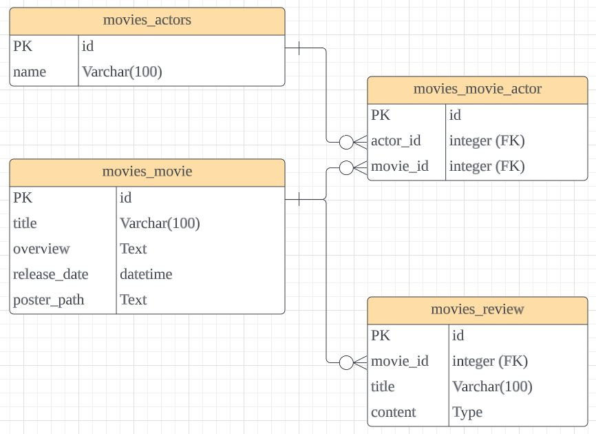

# DRF를 활용한 API 서버 제작
## 학습내용
- JSON 파일의 데이터를 이용하여 API 서버 제작
- 백엔드 내용을 Restful하게 재구성
- 1:N 과 M:N관계에 대해 이해하고 직렬화 구현
- ERD(Entity-Relationship Diagram)에 대한 이해
- Postman 사용을 통한 디버깅
## 어려웠던 부분
- rest-frame이 잘 되어 있어서 크게 어려운 점은 없었다.
- create을 구현할 때 다른 기능에 비해 고려할 내용이 많아 멈칫 했지만 전체 flow를 되새기면서 해결할 수 있었다.
- ERD를 직접 그리고 싶어서 여러 페이지를 탐색한 끝에 Lucid가 가장 나은 결과물을 보였다. 앞으로 ERD 그릴 때는 해당 서비스를 이용할 생각이다.
- 오전에는 지난 내용을 복습하고, 오후에 아무런 도움 없이 제로베이스로 제작하느라 시간이 꽤 걸렸다.
## ERD(Entity Relationship Diagram)

## 오늘의 감정

